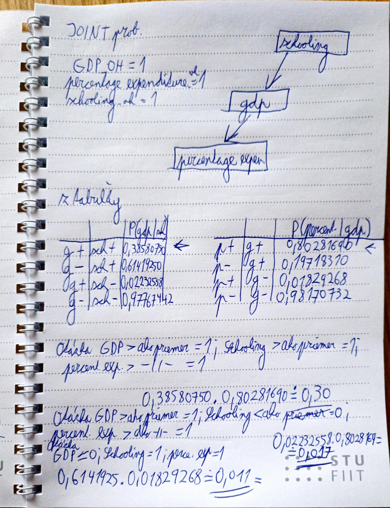
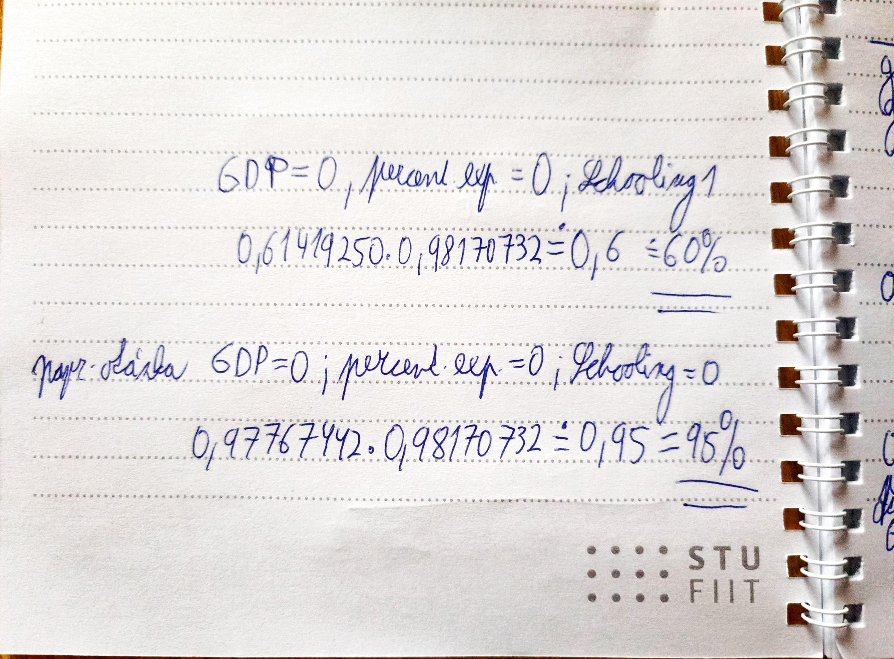

# Regresia, klasifikácia bola odstránená z dôvodu prehľadnosti, EDA bola ponechaná a rozšírená.
```{r setup, include=FALSE}
knitr::opts_chunk$set(warning = FALSE, message = FALSE) # do not show warnings
library(tidyverse)
library(magrittr)
library(ggplot2)
library(dplyr)
getwd() 
#setwd("C:/Users/hrads/Documents/Programming/Ing/2Semester/OZNAL/projekt1") #set working directory
```

## Bc. Peter Slovák, Bc. Pavol Hradský

# Načítanie dát, pred úpravou 

```{r load}
data <- read_csv("Life Expectancy Data.csv", col_names = TRUE)
data
```

# Čo je v našich dátach?

```{r}
str(data) # struktura dát
head(data) 
dim(data) # rozmery dát
sapply(data, class) # vela numerickych dat, vypisane podrobne 
```

Dáta obsahujú **22 stĺpcov** a **2938 záznamov** o kvalite a dĺžke života v **193 krajinách** naprieč rokmi **2000-2015**.


```{r}
table(sapply(data, class))
```

**20 stĺpcov** je **numerických** a **2 kategorické**. Niektoré stĺpce obsahujú aj **NA** hodnoty.

**Kategorické stĺpce:** Country, Status.

**Numerické stĺpce:** Year, Life expectancy, Adult Mortality, infant deaths, Alcohol, percentage expenditure, Hepatitis B, Measles, BMI, under-five deaths, Polio, Total expenditure, Diphtheria, HIV/AIDS, GDP, Population, thinness 1-19 years, thinness 5-9 years, Income composition of resources, Schooling.

```{r}
# Ideme zistit, ci sa v stlpci Life expectancy nachadzaju nejake chybajuce hodnoty, alebo prazdne hodnoty pretoze to je stlpec, ktory budeme predikovat a je pre nas dolezity

# kontrola pre chybajuce hodnoty v stlpci Life expectancy. Zistili sme, ze v stlpci Life expectancy sa nachadza 10 chybajucich hodnot - NA
sum(is.na(data$`Life expectancy`))

# kontrola pre prazdne hodnoty
sum(str_detect(data$`Life expectancy`, "^\\s*$"))

```

Vidíme, že v stĺpci Life expectancy sa nachádza len **10** prázdnych hodnôt - **NA** a **žiaden prázdny reťazec**. Tento stĺpec bude pre nás dôležitý pri lineárnej regresii, kde budeme predikovať práve dĺžku života na základe iných parametrov. Rozhodli sme sa **dropnúť riadky s chýbajúcimi hodnotami v tomto stĺpci**.


# Čistenie datasetu
- odstránenie riadkov s chýbajúcimi hodnotami v stĺpci Life expectancy

```{r}
data <- data %>% drop_na(`Life expectancy`)
missing_values_life_axpextancy <- sum(is.na(data$`Life expectancy`))
missing_values_life_axpextancy
dim(data)
```

# Histogramy

```{r}
# Histogram rozvojových a rozvinutých krajín
data %>%
  count(Status) %>%
  rename(Count = n) %>%
  ggplot(aes(x=Status, y=Count)) + 
  geom_histogram(stat="identity", aes(fill=Count)) + 
  scale_fill_viridis_c()
# Histogram rokov, kedy boli robené merania
data %>%
  count(Year) %>%
  rename(Count = n) %>%
  ggplot(aes(x=Year, y=Count)) + 
  geom_histogram(stat="identity", aes(fill=Count)) + 
  scale_fill_viridis_c()
# Histogram dĺžky života
data %>%
  count(`Life expectancy`) %>%
  rename(Count = n) %>%
  ggplot(aes(x=`Life expectancy`, y=Count)) + 
  geom_histogram(stat="identity", aes(fill=Count)) + 
  scale_fill_viridis_c()
# Histogram adult mortality 
data %>%
  count(`Adult Mortality`) %>%
  rename(Count = n) %>%
  ggplot(aes(x=`Adult Mortality`, y=Count)) + 
  geom_histogram(stat="identity", aes(fill=Count)) + 
  scale_fill_viridis_c()
```

Pri zobrazení histogramov vidíme, že v datasete je **omnoho viac záznamov s rozvojových krajín ako z rozvinutých**. **Roky**, v ktorých boli robené merania, sú zastúpené **rovnomerne**. Pred odstránením predchádzajúcich 10 riadkov pre chýbajúce záznamy v Life expectancy sme mali v jeden rok viac záznamov. Ďalej vidíme rozdelenie dĺžky života a adult mortality.

# Zvyšné chýbajúce hodnoty


```{r, echo=F}
sapply(data, function(x) sum(is.na(x))) # chybajuce hodnoty v stlpcoch
missing_values_na <- sapply(data, function(x) sum(is.na(x)))
missing_values_na <- data.frame(column = names(missing_values_na), missing_values = missing_values_na)
missing_values_na$type <- "NA"

# spočítanie prázdnych hodnôt pre každý stĺpec
missing_values_empty <- sapply(data, function(x) sum(str_detect(x, "^\\s*$")))
missing_values_empty <- data.frame(column = names(missing_values_empty), missing_values = missing_values_empty)
missing_values_empty$type <- "Empty String"

# Combine the two datasets
combined_missing_values <- rbind(missing_values_na, missing_values_empty)

# Plotting
ggplot(combined_missing_values, aes(x = column, y = missing_values, fill = type)) +
  geom_col(position = "dodge") +
  labs(title = "Distribution of Missing and Empty Values for Each Dataset Column",
       x = "Column", y = "Count of Missing and Empty Values") +
  scale_fill_manual(values = c("NA" = "blue", "Empty String" = "red")) +
  theme(axis.text.x = element_text(angle = 45, hjust = 1))
```

Kontrolovali sme aj ostatné chýbajúce hodnoty. Vidíme, že pomerne dosť sa ich nachádza aj v stĺpcoch **Population** a **hepatits B** alebo **GDB**. V ostaných je len menej, alebo žiadne.

Drop NA rows pre použité stĺpce v modeli, kvôli prevencii proti odstráneniu počas predikcii:
```{r}
library(conflicted)
data %<>% 
  dplyr::select(Status, `Life expectancy`, `Adult Mortality`, Alcohol, 
         `percentage expenditure`, BMI, `Total expenditure`, 
         Diphtheria, `HIV/AIDS`, GDP, `Income composition of resources`, 
         Schooling) %>%
  drop_na()

```

## Pairplot

- identifikácia vzťahov a vzorov medzi premennými
```{r}
#-----Helper functions----- z cvika, labov prebrate
panel.cor <- function(x,y, digits=2, prefix="", cex.cor){
  usr <- par("usr")
  on.exit(par(usr))
  par(usr = c(0,1,0,1))
  r <- abs(cor(x,y,use="complete.obs"))
  txt <- format(c(r,0.123456789), digits = digits)[1]
  txt <- paste0(prefix, txt,sep="")
  if(missing(cex.cor)) cex.cor <- 0.8/strwidth(txt)
  text(0.5, 0.5, txt, cex = cex.cor * (1 + r) / 2)
}

panel.hist <- function(x, ...){
  usr <- par("usr")
  on.exit(par(usr))
  par(usr = c(usr[1:2],0,1.5))
  h <- hist(x, plot = FALSE)
  breaks <- h$breaks
  nB <- length(breaks)
  y <- h$counts
  y <- y/max(y)
  rect(breaks[-nB], 0, breaks[-1], y, col="white",...)
}

panel.lm <- function(x, y, col = par("col"), bg = NA, pch = par("pch"),
                     cex = 1, col.smooth = "blue", ...) {
  points(x, y, pch = pch, col = col, bg = bg, cex = cex)
  abline(stats::lm(x ~ y), col = "steelblue", ...)
} 
pairs(~ `Life expectancy` + `Adult Mortality` + Alcohol  +
        `percentage expenditure` + BMI + 
        `Total expenditure` + Diphtheria + `HIV/AIDS` + GDP +
        `Income composition of resources` +
        Schooling, 
      data = data,
      upper.panel= NULL, 
      diag.panel = panel.hist,
      lower.panel = panel.lm)
```

## Korelačná tabuľka

```{r}
#options(repos = c(CRAN = "https://cran.rstudio.com")) # uncomment if you don't have the package installed
#install.packages("corrplot") # uncomment if you don't have the package installed
library(corrplot)
# plot with removed na values

cor(data %>% select(`Life expectancy`, `Adult Mortality`, Alcohol, 
                    `percentage expenditure`, BMI, `Total expenditure`, 
                    Diphtheria, `HIV/AIDS`, GDP, `Income composition of resources`, 
                    Schooling), method = "pearson", use = "pairwise.complete.obs") # deals with na values
  
corrplot(cor(data %>% select(`Life expectancy`, `Adult Mortality`, Alcohol, 
                    `percentage expenditure`, BMI, `Total expenditure`, 
                    Diphtheria, `HIV/AIDS`, GDP, `Income composition of resources`, 
                    Schooling), method = "pearson", use = "pairwise.complete.obs")) # deals with na values

```


# One hot encode status rozvinutosti krajiny pre klasifikáciu
```{r}
data %<>% 
  mutate(status_oh = if_else(Status=='Developed', "1", "0")) %>%
  relocate(status_oh)
  
```

# Priemerné hodnoty pre jednotlivé stĺpce, ktoré budeme používať pri pravdepodobnostných výpočtoch

```{r}

perc_mean <- mean(data$`percentage expenditure`)
GDP_mean <-  mean(data$GDP)
Schooling_mean <- mean(data$Schooling)
Adult_Mortality_mean <- mean(data$`Adult Mortality`)
Alcohol_mean <- mean(data$Alcohol)
life_expectancy_mean <- mean(data$`Life expectancy`)
status_oh_mean <- mean(data$status_oh)

# printing mean values
print(perc_mean)
print(GDP_mean)
print(Schooling_mean)
print(Adult_Mortality_mean)
print(Alcohol_mean)
print(life_expectancy_mean)
```


# One hot stlpec pre Schooling podľa jej mean hodnoty
```{r}

data %<>% 
  mutate(schooling_oh = if_else(Schooling > Schooling_mean, "1", "0")) %>%
  relocate(schooling_oh)

```

# One hot stlpec pre GDP podľa jej mean hodnoty
```{r}

data %<>% 
  mutate(gdp_oh = if_else(GDP > GDP_mean, "1", "0")) %>%
  relocate(gdp_oh)

```


# One hot stlpec pre Adult Mortality podľa jej mean hodnoty
```{r}

data %<>% 
  mutate(adult_mortality_oh = if_else(`Adult Mortality` > Adult_Mortality_mean, "1", "0")) %>%
  relocate(adult_mortality_oh)

```

# One hot stlpec pre Alcohol podľa jej mean hodnoty
```{r}

data %<>% 
  mutate(alcohol_oh = if_else(Alcohol > Alcohol_mean, "1", "0")) %>%
  relocate(alcohol_oh)

```


# One hot stlpec pre percentage expenditure podľa jej mean hodnoty
```{r}

data %<>% 
  mutate(percentage_expenditure_oh = if_else(`percentage expenditure` > perc_mean, "1", "0")) %>%
  relocate(percentage_expenditure_oh)


```

# One hot stlpec pre Life expectancy podľa jej mean hodnoty
```{r}

data %<>% 
  mutate(life_expectancy_oh = if_else(`Life expectancy` > life_expectancy_mean, "1", "0")) %>%
  relocate(life_expectancy_oh)

data %<>%
  select(life_expectancy_oh, percentage_expenditure_oh, alcohol_oh, adult_mortality_oh, gdp_oh, schooling_oh, status_oh)
```

# Vytvorenie základnej tabuľky pravdivostných distribúcií pre one hot encoded stĺpce

```{r}
probTable <- data %>%
  summarise(
    p_0_gdp = sum(gdp_oh=="0")/length(gdp_oh),
    p_1_gdp = 1 - sum(gdp_oh=="0")/length(gdp_oh),
    p_0_schooling = sum(schooling_oh=="0")/length(schooling_oh),
    p_1_schooling = 1 - sum(schooling_oh=="0")/length(schooling_oh),
    p_0_alcohol = sum(alcohol_oh=="0")/length(alcohol_oh),
    p_1_alcohol = 1 - sum(alcohol_oh=="0")/length(alcohol_oh),
    p_0_adult_mortality = sum(adult_mortality_oh=="0")/length(adult_mortality_oh),
    p_1_adult_mortality = 1 - sum(adult_mortality_oh=="0")/length(adult_mortality_oh),
    p_0_percentage_expenditure = sum(percentage_expenditure_oh=="0")/length(percentage_expenditure_oh),
    p_1_percentage_expenditure = 1 - sum(percentage_expenditure_oh=="0")/length(percentage_expenditure_oh),
    p_0_life_expectancy = sum(life_expectancy_oh=="0")/length(life_expectancy_oh),
    p_1_life_expectancy = 1 - sum(life_expectancy_oh=="0")/length(life_expectancy_oh),
    p_0_status_oh = sum(status_oh=="0")/length(status_oh),
    p_1_status_oh = 1 - sum(status_oh=="0")/length(status_oh)
  )

# Converting probability table to matrix
probMatrix <- matrix(c(probTable$p_0_gdp, probTable$p_1_gdp,
                                probTable$p_0_schooling, probTable$p_1_schooling,
                                probTable$p_0_alcohol, probTable$p_1_alcohol,
                                probTable$p_0_adult_mortality, probTable$p_1_adult_mortality,
                                probTable$p_0_percentage_expenditure, probTable$p_1_percentage_expenditure,
                                probTable$p_0_life_expectancy, probTable$p_1_life_expectancy,
                                probTable$p_0_status_oh, probTable$p_1_status_oh),
                              nrow = 7, byrow = TRUE)

# Set column and row names of matrix
colnames(probMatrix) <- c("0", "1")
rownames(probMatrix) <- c("gdp_oh", "schooling_oh", "alcohol_oh", "adult_mortality_oh", "percentage_expenditure_oh", "life_expectancy_oh", "status_oh")

print(probMatrix)
```

# Bayesian sieť s 7 premennými a 10 vzťahovými závislosťami-hranami

```{r}
#vytvorenie sieti bolo inšpirované zdrojom: 
#https://bookdown.org/robertness/causalml/docs/tutorial-probabilistic-modeling-with-bayesian-networks-and-bnlearn.html
#uncomment following lines if you don't have the package installed, if it is no longer available in CRAN - we zipped it
#r = getOption("repos")
#r["CRAN"] = "http://cran.us.r-project.org"
#options(repos = r)

#install.packages("BiocManager")
#BiocManager::install("Rgraphviz")

library(bnlearn)
library(Rgraphviz)

# Bayesian network structure with 7 nodes

required_variables <- c("status_oh", "life_expectancy_oh", "gdp_oh", "schooling_oh", "percentage_expenditure_oh", "adult_mortality_oh", "alcohol_oh")
data <- data[, required_variables]

bn <- empty.graph(nodes = c("gdp_oh", "schooling_oh", "alcohol_oh", "adult_mortality_oh", 
                            "percentage_expenditure_oh", "life_expectancy_oh", "status_oh"))


# matrix pre nastavenie hran
arc.set <- matrix(c("gdp_oh", "percentage_expenditure_oh", 
                    "schooling_oh", "gdp_oh", 
                    "schooling_oh", "alcohol_oh", 
                    "schooling_oh", "status_oh", 
                    "alcohol_oh", "status_oh", 
                    "alcohol_oh", "adult_mortality_oh", 
                    "adult_mortality_oh", "status_oh", 
                    "percentage_expenditure_oh", "adult_mortality_oh",
                    "percentage_expenditure_oh", "life_expectancy_oh",
                    "life_expectancy_oh", "status_oh"), ncol = 2, byrow = TRUE, dimnames = list(NULL, c("from", "to")))

arcs(bn) <- arc.set
arcs(bn)
bnlearn::nodes(bn)
graphviz.plot(bn)

```

```{r}
# fitnutie upravenych one hot encoded dat do bayesian siete, pretoze bnlearn nepodporuje numerické hodnoty
# vysledkom su pravdivostne tabulky na zaklade ktorych sme ratali nase pravdepodobnosti pre marketingove otazky

factor_data <- lapply(data[,], as.factor)

bn.fit <- bnlearn::bn.fit(bn, data = factor_data%>%data.frame())
bn.fit
```


# 6 marketingovo predajných otázok

1. **Aká je pravdepodobnosť, že krajina má vyššie gdp a zároveň má vysoký príjem alkoholu?** 
- joint probability: p(gdp_oh=1, alcohol_oh=1)  

2. **Aká je pravdepodobnosť, že úmrtnosť dospelých je vyššia a je vyšší príjem aj alkoholu?**
- joint probability: p(life_expectancy_oh=1, status_oh=1)

3. **Ak má krajina vyššie GDP ako priemer zo všetkých skúmaných v datasete a človek v nej študuje dlhšie ako priemer zo všetkých skúmaných v datasete, aká je pravdepodobnosť, že bude mať vyššie percentage expenditure (percentuálne výdavky) ako priemer zo všetkých skúmaných v datasete?**
- conditional probability: p(percentage_expenditure_oh=1 | gdp_oh=1, schooling_oh=1)

4. **Ak má krajina nižšie GDP ako priemer zo všetkých skúmaných v datasete a človek v nej študuje menej ako priemer zo všetkých skúmaných v datasete, aká je pravdepodobnosť, že bude mať nižšie percentage expenditure (percentuálne výdavky) ako priemer zo všetkých skúmaných v datasete?**
- conditional probability: p(percentage_expenditure_oh=0 | gdp_oh=0, schooling_oh=0)

5. **Aká je pravdepodobnosť, že je krajina rozvinutá za predpokladu, že schooling je vyššie a konzumácia alkoholu je nižšia?**
- conditional probability: p(status_oh=1 | schooling_oh=1, alcohol_oh=0)

6. **Aká je pravdepodobnosť, že krajina je považovaná za rozvinutú?**
- marginal probability: p(status_oh=1)


## Joint probability

1. joint: Aká je pravdepodobnosť, že krajina má vyššie gdp a zároveň má vysoký príjem alkoholu?
```{r}

# dolezite pravdepodobnosti:
bn.fit[["gdp_oh"]][["prob"]]
bn.fit[["alcohol_oh"]][["prob"]]
bn.fit[["schooling_oh"]][["prob"]]


#p(gdp_oh=1, alcohol_oh=1)

p_schooling_oh_0 <- 0.4671882
p_schooling_oh_1 <- 0.5328118 

# Conditional probabilities
P_gdp_1_given_schooling_0 <- 0.02232558
P_gdp_1_given_schooling_1 <- 0.38580750

P_alcohol_1_given_schooling_0 <- 0.1944186
P_alcohol_1_given_schooling_1 <- 0.6517129

# joint probability ked schooling_oh = 0
joint_prob_schooling_0 <- P_gdp_1_given_schooling_0 * P_alcohol_1_given_schooling_0 * p_schooling_oh_0

# joint probability ked schooling_oh = 1
joint_prob_schooling_1 <- P_gdp_1_given_schooling_1 * P_alcohol_1_given_schooling_1 * p_schooling_oh_1

cat("Joint probability vyššieho GDP a vyššieho príjmu alcohol keď schooling_oh = 0 (študujeme kratšie):", joint_prob_schooling_0*100, "\n")
cat("Joint probability vyššieho GDP a vyššieho príjmu alcohol keď schooling_oh = 1 (študujeme dlhšie):", joint_prob_schooling_1*100, "\n")

```

Vzorec keď schooling_oh = 0 (študujeme kratšie):
$$
P(gdp=1,alcohol=1∣schooling=0)=p(gdp=1∣schooling=0)×p(alcohol=1∣schooling=0)×p(schooling=0)
$$
Vzorec keď schooling_oh = 1 (študujeme dlhšie):
$$
P(gdp=1,alcohol=1∣schooling=1)=p(gdp=1∣schooling=1)×p(alcohol=1∣schooling=1)×p(schooling=1)
$$
Záver:

Dlhšie štúdium je spojené s vyššou pravdepodobnosťou, že krajina má vyššie GDP a zároveň vyššie požívanie alkoholu. 


2. joint: Aká je pravdepodobnosť, že úmrtnosť dospelých je vyššia a je vyšší príjem aj alkoholu?
```{r}

# dolezite pravdepodobnosti:
bn.fit[["adult_mortality_oh"]][["prob"]]
bn.fit[["alcohol_oh"]][["prob"]]
bn.fit[["schooling_oh"]][["prob"]]
bn.fit[["percentage_expenditure_oh"]][["prob"]]

#p(adult_mortality_oh=1, alcohol_oh=1)


p_adult_mortality_oh_1 <- 0.4089526
p_adult_mortality_oh_0 <- 0.5910474

p_alcohol_oh_0 <- 0.5619296
p_alcohol_oh_1 <- 0.4380704

p_percentage_expenditure_oh_0 <- 0.8122555
p_percentage_expenditure_oh_1 <- 0.1877445

# Conditional probabilities
# Ak percentualne vydavky (percentage_expenditure_oh) su vyssie ako priemer zo vsetkych skumaných v datasete
P_percentage_expenditure_1_given_gdp_1 <- 0.80281690
P_percentage_expenditure_1_given_gdp_0 <- 0.01829268

p_adult_mortality_1_given_alcohol_1_percentage_expenditure_1 <- 0.10089021
# Ak percentualne vydavky (percentage_expenditure_oh) su nizsie ako priemer zo vsetkych skumaných v datasete
P_percentage_expenditure_0_given_gdp_1 <- 0.19718310
P_percentage_expenditure_0_given_gdp_0 <- 0.98170732

p_adult_mortality_1_given_alcohol_1_percentage_expenditure_0 <- 0.42622951
# joint probability ked percentage_expenditure_oh = 1

joint_probability <- p_percentage_expenditure_oh_1 * p_adult_mortality_1_given_alcohol_1_percentage_expenditure_1
# Output the result
cat("Joint probability úmrtnosť dospelých je vyššia a je vyšší príjem aj alkoholu keď percentage_expenditure_oh = 1 (percentuálne výdavky väčší ako mean):", joint_probability*100, "\n")

# Calculate joint probability ked percentage_expenditure_oh = 0

joint_probability <- p_percentage_expenditure_oh_0 * p_adult_mortality_1_given_alcohol_1_percentage_expenditure_0
# Output the result
cat("Joint probability úmrtnosť dospelých je vyššia a je vyšší príjem aj alkoholu keď percentage_expenditure_oh = 0 (percentuálne výdavky menší ako mean):", joint_probability*100, "\n")

```

Vzorec, percentage_expenditure_oh = 1:
$$
P(adult mortality=1,alcohol=1∣percentage expenditure=1)=p(adult mortality=1∣alcohol=1,percentage expenditure=1)×p(percentage expenditure=1)
$$

Vzorec, percentage_expenditure_oh = 0:
$$
P(adult mortality=1,alcohol=1∣percentage expenditure=0)=p(adult mortality=1∣alcohol=1,percentage expenditure=0)×p(percentage expenditure=0)
$$

Záver:

Keď sú percentuálne výdavky nižšie, existuje výrazne vyššia pravdepodobnosť, že úmrtnosť dospelých je vyššia a zároveň je vyšší príjem aj alkoholu. Naopak, pri vyšších percentuálnych výdavkoch je táto pravdepodobnosť výrazne nižšia.


## Conditional probability

1. conditional: Ak má krajina vyššie GDP ako priemer zo všetkých skúmaných v datasete a človek v nej študuje dlhšie ako priemer zo všetkých skúmaných v datasete, aká je pravdepodobnosť, že bude mať vyššie percentage expenditure (percentuálne výdavky) ako priemer zo všetkých skúmaných v datasete?
```{r}

# dolezite pravdepodobnosti:
bn.fit[["gdp_oh"]][["prob"]]
bn.fit[["schooling_oh"]][["prob"]]
bn.fit[["percentage_expenditure_oh"]][["prob"]]

#p(percentage_expenditure_oh=1 | gdp_oh=1, schooling_oh=1)

# Conditional probabilities
P_gdp_1_given_schooling_1 <- 0.38580750
p_percentageexpend_1_given_gdp_1 <- 0.80281690

# Calculate conditional probability
conditional_prob <- p_percentageexpend_1_given_gdp_1 * P_gdp_1_given_schooling_1

print(conditional_prob*100)

```

Vzorec:
$$
P(\text{percentage_expenditure_oh} = 1 | \text{gdp_oh} = 1, \text{schooling_oh} = 1) = P(\text{percentage_expenditure_oh} = 1 | \text{gdp_oh} = 1) \times P(\text{gdp_oh} = 1 | \text{schooling_oh} = 1)
$$
Záver:
Keď má krajina vyššie GDP a človek v nej študuje dlhšie, existuje približne 31 % pravdepodobnosť, že bude mať vyššie percentage expenditure (výdavky).

2. conditional: Ak má krajina nižšie GDP ako priemer zo všetkých skúmaných v datasete a človek v nej študuje menej ako priemer zo všetkých skúmaných v datasete, aká je pravdepodobnosť, že bude mať nižšie percentage expenditure (percentuálne výdavky) ako priemer zo všetkých skúmaných v datasete?
```{r}

# dolezite pravdepodobnosti:
bn.fit[["gdp_oh"]][["prob"]]
bn.fit[["schooling_oh"]][["prob"]]
bn.fit[["percentage_expenditure_oh"]][["prob"]]

#p(percentage_expenditure_oh=0 | gdp_oh=0, schooling_oh=0)

# Conditional probabilities
P_gdp_0_given_schooling_0 <- 0.97767442
p_percentageexpend_0_given_gdp_0 <- 0.98170732 

# Calculate conditional probability
conditional_prob <- p_percentageexpend_0_given_gdp_0 * P_gdp_0_given_schooling_0
print(conditional_prob*100)

```

Vzorec:
$$
P(\text{percentage_expenditure_oh} = 0 | \text{gdp_oh} = 0, \text{schooling_oh} = 0) = P(\text{percentage_expenditure_oh} = 0 | \text{gdp_oh} = 0) \times P(\text{gdp_oh} = 0 | \text{schooling_oh} = 0)
$$
Záver:
Keď má krajina nižšie GDP a človek v nej študuje menej, existuje približne 96 % pravdepodobnosť, že bude mať nižšie percentage expenditure (výdavky).

Vyrátané niektoré z vyšších pravdepodobností na papier, výsledky boli približne rovnaké (hodnota 1 a 0 značí, či je hodnota väčšia ako priemer pre danú meranú premennú alebo nie):





3. conditional: Aká je pravdepodobnosť, že je krajina rozvinutá za predpokladu, že schooling je vyššie a konzumácia alkoholu je nižšia?
```{r}

# dolezite pravdepodobnosti:
bn.fit[["status_oh"]][["prob"]]

#p(status_oh=1 | schooling_oh=1, alcohol_oh=0)

p_status_oh_1_given_by_alcohol_oh_0 <- 0.06285714 # scitanie vsetkych moznost kde je status_oh=1 a alcohol_oh=0 (ostatne pravdepodobnosti su nulove)
p_status_oh_1_given_by_schooling_oh_1 <- 0.28703704 + 0.58995138 + 0.06285714 # scitanie vsetkych moznost kde je status_oh=1 a schooling_oh=1 (ostatne pravdepodobnosti su nulove)

conditional_prob <- p_status_oh_1_given_by_alcohol_oh_0 * p_status_oh_1_given_by_schooling_oh_1
print(conditional_prob*100)

```
Vzorec:
$$
P(\text{status_oh} = 1 | \text{schooling_oh} = 1, \text{alcohol_oh} = 0)
\\
= P(\text{status_oh} = 1 | \text{schooling_oh} = 1) \times P(\text{status_oh} = 1 | \text{alcohol_oh} = 0)
$$

Záver:
Pravdepodobnosť, že je krajina rozvinutá za predpokladu, že schooling je vyššie a konzumácia alkoholu je nižšia je takmer 6%. Je to spôsobené tým, že v rozvinutých krajinách je väčšinou vyššia konzumácia alkoholu.


## Marginal probability

1. marginal: Aká je pravdepodobnosť, že krajina je považovaná za rozvinutú?
```{r}

# dolezite pravdepodobnosti:
bn.fit[["status_oh"]][["prob"]]

#p(status_oh=1)

# Conditional probabilities
p_status_1_alcohol_0_am_0_le_0_shooling_0 = 0
p_status_1_alcohol_0_am_0_le_0_shooling_1 = 0

p_status_1_alcohol_1_am_0_le_0_shooling_0 = 0
p_status_1_alcohol_1_am_0_le_0_shooling_1 = 0

p_status_1_alcohol_0_am_1_le_0_shooling_0 = 0
p_status_1_alcohol_0_am_1_le_0_shooling_1 = 0

p_status_1_alcohol_1_am_1_le_0_shooling_0 = 0
p_status_1_alcohol_1_am_1_le_0_shooling_1 = 0

p_status_1_alcohol_0_am_0_le_1_shooling_0 = 0
p_status_1_alcohol_0_am_0_le_1_shooling_1 = 0.06285714

p_status_1_alcohol_1_am_0_le_1_shooling_0 = 0
p_status_1_alcohol_1_am_0_le_1_shooling_1 = 0.58995138

p_status_1_alcohol_0_am_1_le_1_shooling_0 = 0
p_status_1_alcohol_0_am_1_le_1_shooling_1 = 0

p_status_1_alcohol_1_am_1_le_1_shooling_0 = 0.17647059
p_status_1_alcohol_1_am_1_le_1_shooling_1 = 0.28703704

# Calculate marginal probability
p_status_1_marginal = 
  p_status_1_alcohol_0_am_0_le_0_shooling_0 + p_status_1_alcohol_0_am_0_le_0_shooling_1 +
  p_status_1_alcohol_1_am_0_le_0_shooling_0 + p_status_1_alcohol_1_am_0_le_0_shooling_1 +
  p_status_1_alcohol_0_am_1_le_0_shooling_0 + p_status_1_alcohol_0_am_1_le_0_shooling_1 +
  p_status_1_alcohol_1_am_1_le_0_shooling_0 + p_status_1_alcohol_1_am_1_le_0_shooling_1 +
  p_status_1_alcohol_0_am_0_le_1_shooling_0 + p_status_1_alcohol_0_am_0_le_1_shooling_1 +
  p_status_1_alcohol_1_am_0_le_1_shooling_0 + p_status_1_alcohol_1_am_0_le_1_shooling_1 +
  p_status_1_alcohol_0_am_1_le_1_shooling_0 + p_status_1_alcohol_0_am_1_le_1_shooling_1 +
  p_status_1_alcohol_1_am_1_le_1_shooling_0 + p_status_1_alcohol_1_am_1_le_1_shooling_1

p_status_1_marginal

```

Vzorec:
$$
\sum_{alcohol} \sum_{am} \sum_{le} \sum_{schooling} P(status=1, alcohol, am, le, schooling) 
$$


Záver:
V datasete máme príliš málo krajín, ktoré sa dajú považovať za rozvinuté, preto je pravdepodobnosť, že krajina je považovaná za rozvinutú, veľmi nízka. Jej hodnota je 1,116316 %.

## Manažérske zhrnutie:

Na základe vyššie uvedených pravdepodobností môžeme vyvodiť nasledujúce závery:

1. Dlhšie štúdium je spojené s vyššou pravdepodobnosťou, že krajina má vyššie GDP a zároveň vyššie požívanie alkoholu.
2. Keď sú percentuálne výdavky nižšie, existuje výrazne vyššia pravdepodobnosť, že úmrtnosť dospelých je vyššia a zároveň je vyšší príjem aj alkoholu. Naopak, pri vyšších percentuálnych výdavkoch je táto pravdepodobnosť výrazne nižšia.
3. Keď má krajina vyššie GDP a človek v nej študuje dlhšie, existuje približne 31 % pravdepodobnosť, že bude mať vyššie percentage expenditure (výdavky).
4. Keď má krajina nižšie GDP a človek v nej študuje menej, existuje približne 96 % pravdepodobnosť, že bude mať nižšie percentage expenditure (výdavky).
5. Pravdepodobnosť, že je krajina rozvinutá za predpokladu, že schooling je vyššie a konzumácia alkoholu je nižšia, takmer 6 %.
6. V datasete máme príliš málo krajín, ktoré sa dajú považovať za rozvinuté, preto je pravdepodobnosť, že krajina je považovaná za rozvinutú, veľmi nízka. Jej hodnota je 1,116316 %.

